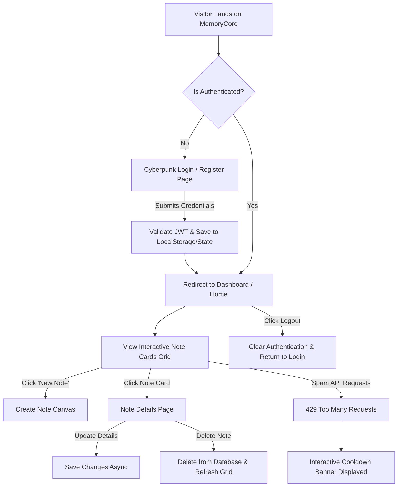

# 🌌 MemoryCore — Multi-User MERN Note Canvas

Welcome to **MemoryCore**, a modern, multi-user, and highly secure MERN stack note management application. Wrapped in a premium Cyberpunk-inspired dark aesthetic using Tailwind CSS & DaisyUI's `"night"` theme, it represents an ideal starter-to-intermediate project illustrating production-ready authentication, API rate limiting, and standard database integration.

---

## 🎨 Tech Stack Showcase
MemoryCore is constructed using a robust stack designed for responsive client-side rendering and scalable backend services.

### 💻 Frontend


*   **Vite + React (v19):** Lightning-fast hot module replacement and build tooling.
*   **TailwindCSS + DaisyUI:** Dynamic night-theme colors, glassmorphism, responsive grids, and standard components without bloatware.
*   **Axios:** Customized HTTP requests featuring client-side API routing and automatic request-level authorization.

---

### ⚙️ Backend & Database


*   **Node.js & Express.js:** Built using **ES6 Modules (`"type": "module"`)** for clean imports.
*   **MongoDB + Mongoose:** Scalable document database storing users and notes with relational reference schemas.
*   **Upstash Redis + Upstash Rate Limit:** A serverless caching rate limiter checking API routes to prevent server abuse.
*   **BCryptJS + JSON Web Tokens (JWT):** Password hashing and secure token-based user authentication.

---

## 🚀 Key Features

*   🔒 **Secure Multi-User Sandbox:** Users register and sign in to access their unique workspace. You will never see or modify another user's notes.
*   ⚡ **Full Note CRUD Canvas:** Create, read details, edit, and delete notes asynchronously.
*   🚦 **DDoS Protection & Rate Limiting:** Powered by Upstash Redis, the server automatically monitors client request frequencies. If limits are exceeded, a gorgeous custom "Rate Limited UI" warning blocks abuse interactively.
*   💥 **Cyberpunk Aesthetics:** Night mode UI complete with sleek gradients, styled input fields, and real-time status indicators.
*   🍞 **Interactive Feedback toasts:** Real-time feedback via `react-hot-toast` displays success messages when notes are modified or errors happen.

---

## 📊 Application User Flow

Below is the layout of the user journey inside MemoryCore:



---

## 📁 Project Structure

Here is a map of the file layout inside MemoryCore:

```text
MemoryCore/
├── backend/                  # Node.js Express API Server
│   ├── config/               # Connections to external databases
│   │   ├── db.js             # Mongoose MongoDB Connection
│   │   └── upstash.js        # Upstash Redis Client (Rate Limiter)
│   ├── controllers/          # API Handler logic functions
│   │   ├── authController.js # Handles registration, login, logout
│   │   └── notesController.js# Handles MongoDB Note CRUD logic
│   ├── middleware/           # Route filter middleware
│   │   ├── authMiddleware.js # Enforces JWT validation for requests
│   │   └── rateLimiter.js    # Integrates Upstash Redis rate limiting
│   ├── models/               # MongoDB models definitions
│   │   ├── Note.js           # Note database Schema
│   │   └── User.js           # User profile Schema
│   ├── routes/               # API Router bindings
│   │   ├── authRoutes.js     # Auth API pathways
│   │   └── notesRoutes.js    # Note CRUD endpoints
│   ├── server.js             # Express startup file
│   └── package.json          # Server dependencies list
│
├── frontend/                 # React Client Application
│   ├── public/               # Public assets & visual files
│   │   └── memorycore-hero.png # Cyberpunk graphic used on Login page
│   ├── src/                  # Client source code
│   │   ├── components/       # Modular UI components
│   │   │   ├── Navbar.jsx    # Sticky navigation and user profile
│   │   │   ├── NoteCard.jsx  # Interactive card representing notes
│   │   │   ├── NotesNotFound.jsx # Empty state UI if no notes exist
│   │   │   └── RateLimitedUI.jsx # Warning prompt for rate-limiting action
│   │   ├── context/          # Application global store
│   │   │   └── AuthContext.jsx # Global authorization state
│   │   ├── lib/              # Client Helper functions
│   │   │   ├── axios.js      # Configured Axios client with Interceptors
│   │   │   └── utils.js      # Utility functions
│   │   ├── pages/            # Full client views
│   │   │   ├── HomePage.jsx  # Primary Dashboard showing the note grid
│   │   │   ├── CreatePage.jsx# Custom note creating panel
│   │   │   ├── NoteDetailPage.jsx # Custom detail editor & deletion pane
│   │   │   └── Login.jsx     # Cyberpunk Split Form Login View
│   │   ├── App.jsx           # App Root, Router & Routing Guards
│   │   ├── index.css         # CSS and Tailwind declarations
│   │   └── main.jsx          # React entry root file
│   ├── tailwind.config.js    # Custom Tailwind & DaisyUI configs
│   └── package.json          # Frontend dependencies configuration
└── README.md                 # Interactive Project Manual (This file)
```

---

## 📦 Package Catalog

<details>
<summary>🔍 <b>Backend Packages Explained</b></summary>
<br>

| Package | Purpose | Category |
| :--- | :--- | :--- |
| **express** | Lightweight framework to build HTTP REST APIs. | Core Framework |
| **mongoose** | Schema-based modeling engine for MongoDB. | Database ORM |
| **jsonwebtoken** | Generates & verifies tokens to support stateless authorization. | Security |
| **bcryptjs** | Hashes raw user passwords before storing to database. | Security |
| **@upstash/redis** | Serverless client designed to connect to global Redis databases. | Security & Cache |
| **@upstash/ratelimit**| Out-of-the-box rate limiting algorithms powered by Upstash. | Performance |
| **cors** | Configures policies for cross-origin client network traffic. | Server Config |
| **dotenv** | Loads local server settings and secrets from `.env` files. | Dev Config |
| **nodemon** *(Dev)* | Automatically restarts the Node server when file edits are detected. | Dev Utility |

</details>

<details>
<summary>🔍 <b>Frontend Packages Explained</b></summary>
<br>

| Package | Purpose | Category |
| :--- | :--- | :--- |
| **react** | Declarative component library to build visual user interfaces. | UI Library |
| **react-router-dom** | Declarative client routing to seamlessly navigate pages. | Navigation |
| **axios** | Handles request/response API logic with custom configurations. | Data Fetching |
| **daisyui** | Modern CSS component templates built on top of Tailwind. | CSS Styling |
| **tailwindcss** | Utility-first CSS utility framework for fast design changes. | Core Styling |
| **lucide-react** | Clean, highly consistent vector icon set. | UI Icons |
| **react-hot-toast** | Lightweight, animated error and success notification toasts. | Interactive UI |

</details>

---

## 🛠️ Installation & Setup

Get MemoryCore running on your local machine in minutes.

### 1. Clone & Navigate
```bash
git clone <your-repository-url>
cd MemoryCore
```

### 2. Configure Environment Variables
You will need to supply database credentials to run the server.

*   Create a `.env` file inside the `backend/` directory:

```env
PORT=5001
MONGO_URI=mongodb+srv://<username>:<password>@cluster.mongodb.net/memorycore
JWT_SECRET=your_super_secret_jwt_key_here

# Upstash Redis details (For Rate Limiting)
UPSTASH_REDIS_REST_URL=https://<your-redis-instance>.upstash.io
UPSTASH_REDIS_REST_TOKEN=your_upstash_rest_token_here
```

---

### 3. Startup Guide

#### 🟢 Run Backend (API Server)
Open a terminal in the project directory:
```bash
cd backend
npm install
npm run dev
```
*The API server will launch locally at: `http://localhost:5001`*

#### 🔵 Run Frontend (React Client)
Open a separate terminal in the project directory:
```bash
cd frontend
npm install
npm run dev
```
*The Vite Dev Server will compile and run at: `http://localhost:5173`*

---

## 🚦 Interactive Features Demo

### Custom Auth Router Guards
Unauthenticated clients are locked out of dashboard pages automatically:
```javascript
// Inside App.jsx routing logic
<Route path="/" element={user ? <HomePage /> : <Navigate to="/login" />} />
<Route path="/create" element={user ? <CreatePage /> : <Navigate to="/login" />} />
```

### Rate Limiting Simulation
To trigger the rate-limiting safeguard, make repeated network requests to create or delete notes. When the rate-limiter triggers, Axios catches the `429` status code and launches this overlay:
```jsx
// Triggered on HTTP 429 Status Response
{isRateLimited && (
  <div className="alert alert-warning shadow-lg animate-bounce">
    <span>⚠️ Slow down! Request limit exceeded. Please wait a moment.</span>
  </div>
)}
```

---

## 💬 FAQ & Support

<details>
<summary>💡 <b>What should I do if my MongoDB Connection fails?</b></summary>
Verify your IP address is whitelisted in your MongoDB Atlas Dashboard security configuration, and double-check your connection credentials inside `backend/.env`.
</details>

<details>
<summary>💡 <b>How do I modify the rate limit rules?</b></summary>
You can adjust request allowances inside `backend/middleware/rateLimiter.js`. By default, it allows a custom count (e.g. 10 requests) per window.
</details>

<details>
<summary>💡 <b>Can I change the cyberpunk landing banner?</b></summary>
Yes! Simply navigate to `frontend/public/` and replace `memorycore-hero.png` with any visual artwork of your choice.
</details>

---

*Designed & developed for MemoryCore stack beginners.* 🌌
